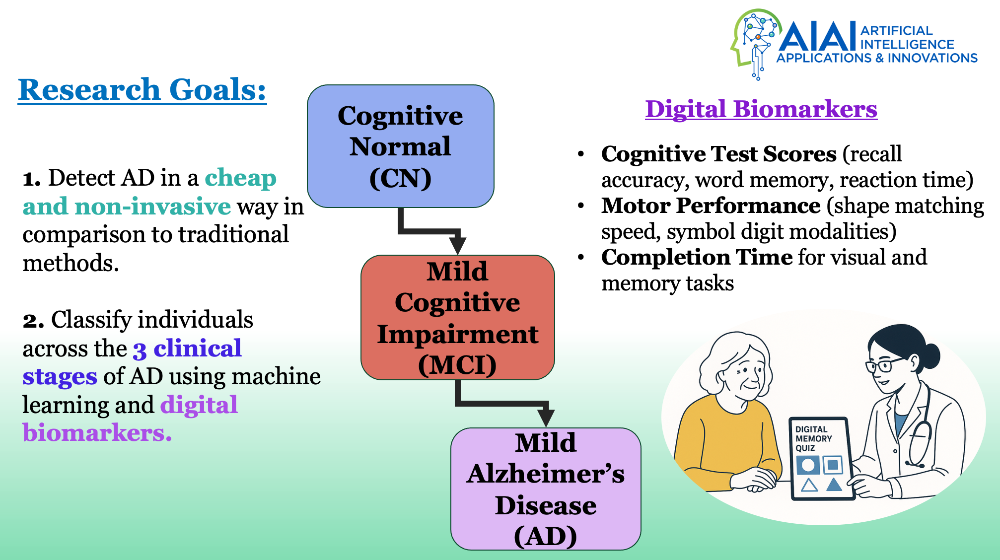
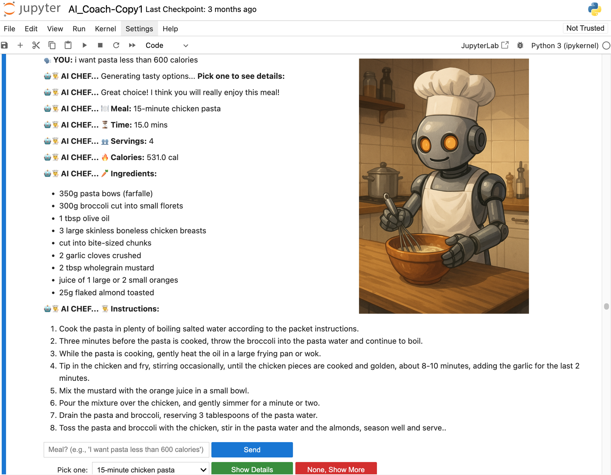
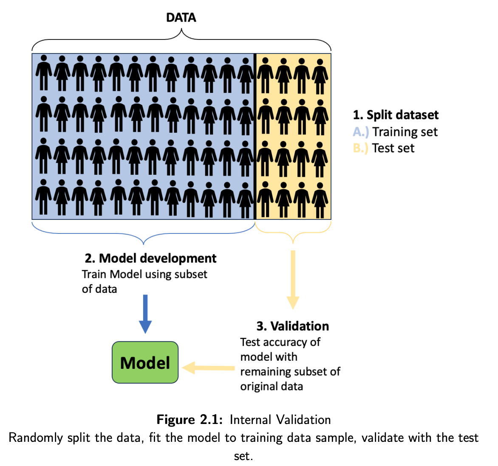
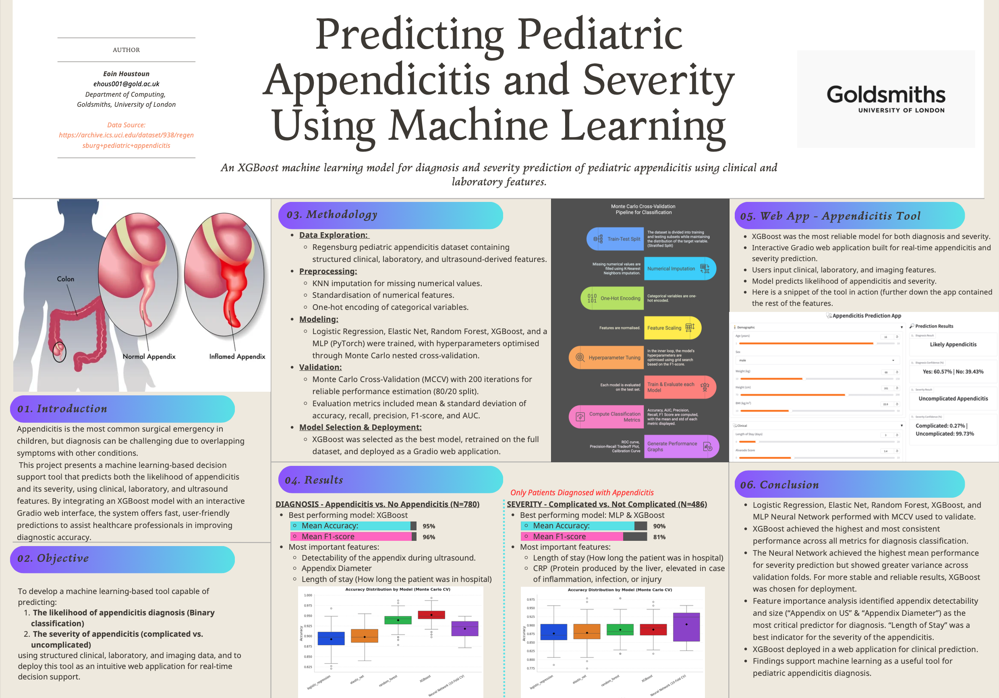

# Portfolio
---

## Featured Projects

### Alzheimer's Disease Classification using Digital Biomarkers
Classified individuals into cognitive stages using machine learning models on the Bio-Hermes dataset. 
- Presented at the [AIAI 2025 conference](https://ifipaiai.org/2025/)
- Published in [Artificial Intelligence Applications and Innovations (Springer)](https://link.springer.com/chapter/10.1007/978-3-031-96235-6_5)
- Techniques: XGBoost, Monte Carlo CV, Random Forest, Feature Selection  
- 📂 [Project Repo](https://github.com/EoinHoustoun/Alzheimers_Biohermes/blob/main/README.md) 

---

### Fever Prediction & Classification with Infrared Thermography
Developed regression and classification models to estimate oral temperature and fever status (≥ 37.5 °C) using non-contact thermal sensor data.
- Techniques: Nested cross-validation, custom PyTorch MLPs, XGBoost, SHAP
- 📂 [Project Repo](https://github.com/EoinHoustoun/Infrared_Thermography/blob/main/README.md)

---
### Neural Style Transfer - Generative AI
Neural Style Transfer with generative AI models to transform a celebrity face into a comic book illustration style.
- Techniques: Neural Style Transfer, Convolutional Neural Networks (VGG19), PyTorch implementation
- 📂 [Project Repo](https://github.com/EoinHoustoun/Generative_AI/blob/main/README.md) 

---

### AI Chef Chatbot with NLP
An interactive recipe chatbot using DistilBERT and TF-IDF with a Tkinter-based GUI.  
- Techniques: NLP, Cosine Similarity, TF-IDF, Tkinter, LLM, SLM, Web Scraping, Beautiful Soup  
- 📂 [Project Repo](https://github.com/EoinHoustoun/AI_Chef/blob/main/README.md)

---

### Exploration of Validation Procedures
Investigated the impact of various validation methods in machine learning on a case study: football player transfer fee prediction.
- Techniques: Regression, Cross-Validation, Monte Carlo CV, Temporal Validation, Bootstrapping, XGBoost, Random Forest.
- 📂 [Project Repo](https://github.com/EoinHoustoun/Final-Year-Project/blob/main/README.md)

---

### Pediatric Appendicitis Diagnosis and Severity Prediction
Developed a machine learning tool to predict pediatric appendicitis diagnosis and severity using clinical, laboratory, and ultrasound data. Deployed an interactive Gradio web application for real-time clinical decision support.
- Techniques: Classification, Monte Carlo Cross-Validation, XGBoost, MLP Neural Networks, SHAP, Gradio, Feature Importance Analysis.
- 📂 [Project Repo](https://github.com/EoinHoustoun/Pediatric_Appendicitis/blob/main/README.md)

---
### Building a recommendation system to recommend the best Amazon products to users
### Predicting Potential Retail Customers 
### Customer Personality Segmentation

Click Badge to see [MIT ePortfolio](https://www.mygreatlearning.com/eportfolio/eoin-houstoun)

