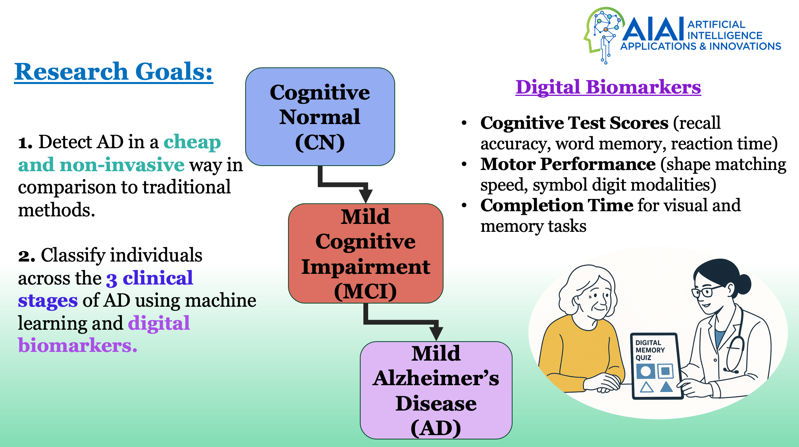
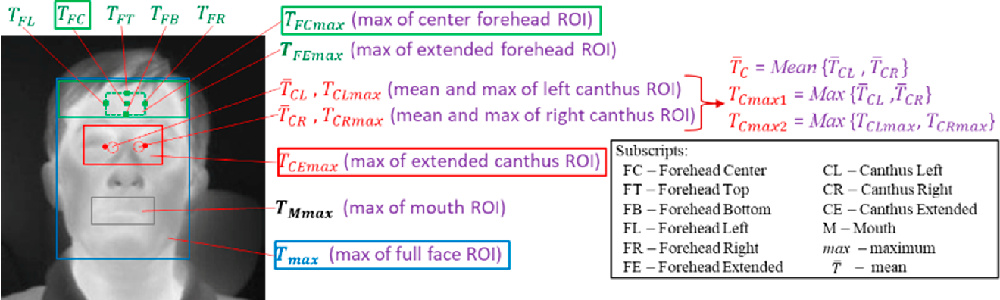
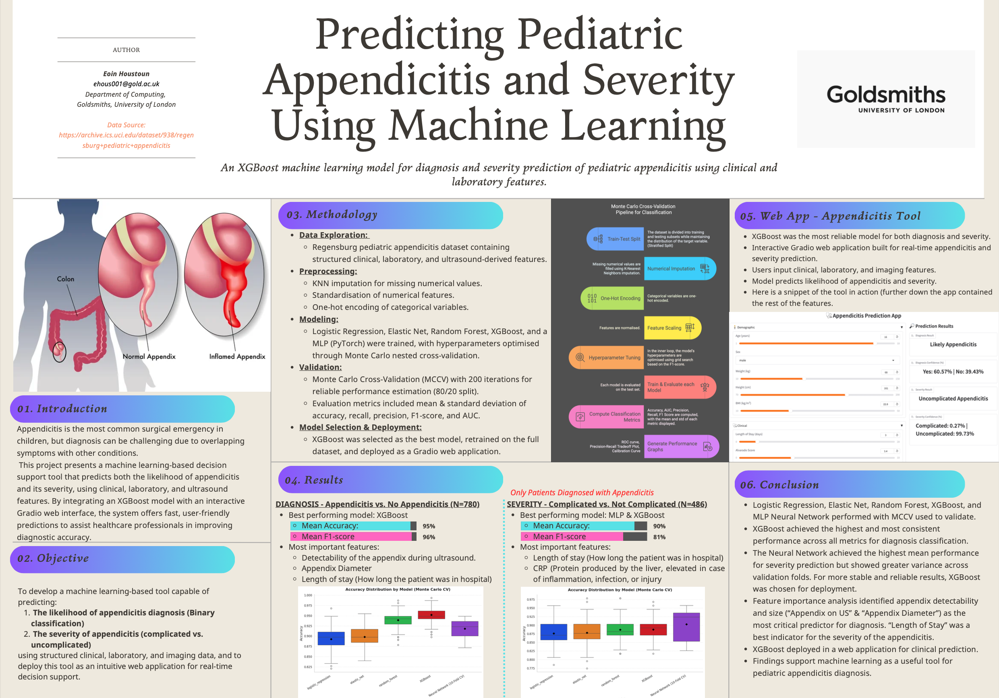
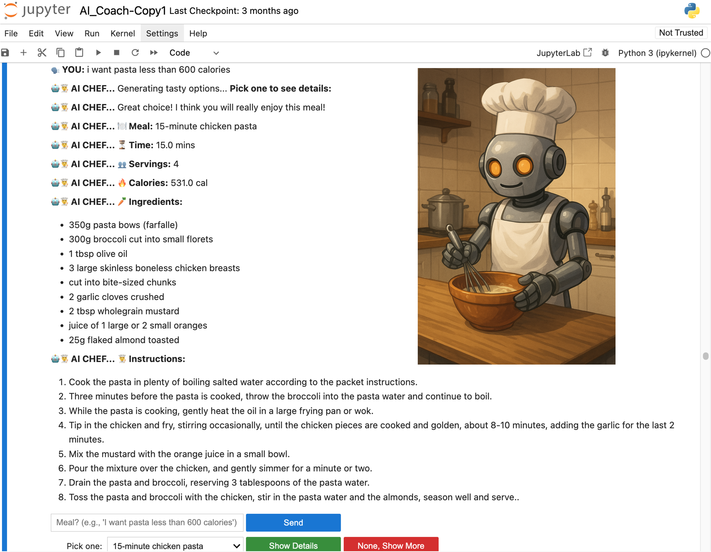
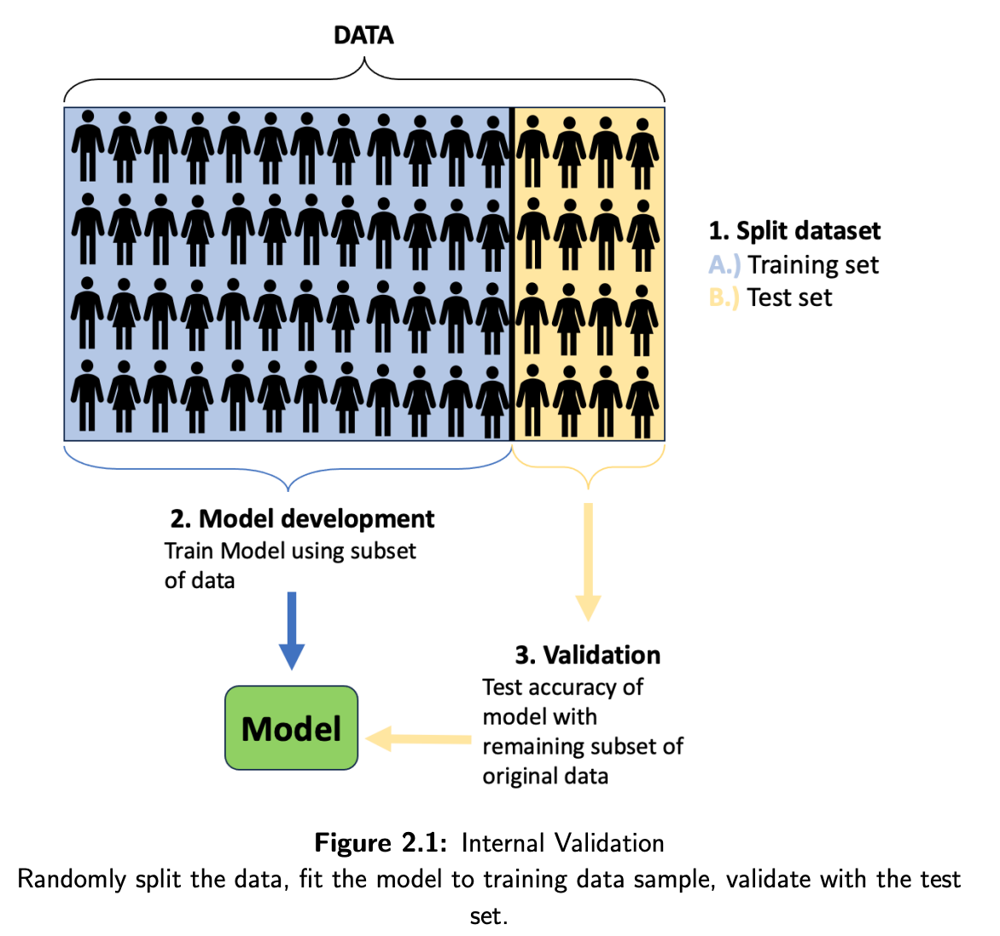

# Eoin Houstoun | Data Scientist & AI Engineer

---

## Published Research

> ### Classifying Cognitive States of Alzheimer's Disease with Machine Learning Using Digital Biomarkers from the Bio-Hermes Study Cohort
>
> **Eoin Houstoun et al.**
> Published in **Springer's _Artificial Intelligence Applications and Innovations_**, AIAI 2025
> IFIP Advances in Information and Communication Technology · Springer, Cham · 2025
>
> 
> 
> 

A machine learning study classifying individuals into cognitive states of Alzheimer's disease using the Bio-Hermes digital biomarker dataset.
Models: **XGBoost**, **Random Forest**, **Monte Carlo cross-validation**, rigorous feature selection.

---

## Projects

| Project | Category | Key Models / Techniques | Status |
|---------|----------|------------------------|--------|
| [Alzheimer's Disease Classification](https://github.com/EoinHoustoun/Alzheimers_Biohermes) | Research · Clinical AI | XGBoost, Random Forest, Monte Carlo CV, Feature Selection | **Published at AIAI 2025** |
| [Fever Prediction with Infrared Thermography](https://github.com/EoinHoustoun/Infrared_Thermography) | Clinical AI | PyTorch MLP, XGBoost, SHAP, Nested CV | Complete |
| [Pediatric Appendicitis Prediction](https://github.com/EoinHoustoun/Pediatric_Appendicitis) | Clinical AI | XGBoost, MLP, SHAP, Gradio | **Live Demo** |
| [Neural Style Transfer](https://github.com/EoinHoustoun/Generative_AI) | Computer Vision | VGG19, PyTorch CNN, Neural Rendering | Complete |
| [AI Chef Chatbot](https://github.com/EoinHoustoun/AI_Chef) | NLP | DistilBERT, TF-IDF, Web Scraping, Tkinter | Complete |
| [Validation Procedures Exploration](https://github.com/EoinHoustoun/Final-Year-Project) | Research · ML | Regression, Cross-Validation, Bootstrapping, Temporal Validation | Complete |
| Amazon Recommendation System | NLP · RecSys | Collaborative Filtering, Content-Based | Complete |
| Retail Customer Prediction | Data Science | Classification Ensembles | Complete |
| Customer Segmentation | Data Science | Unsupervised Clustering | Complete |

---

## Project Highlights

### 1. Alzheimer's Disease Classification: *Published at AIAI 2025, Springer*

Classified individuals into cognitive states of Alzheimer's disease using ML on the Bio-Hermes digital biomarker dataset. Lead author of peer-reviewed paper published in Springer's *Artificial Intelligence Applications and Innovations*.

- Models: XGBoost, Random Forest, Monte Carlo cross-validation, feature selection
- [View Paper on Springer](https://link.springer.com/chapter/10.1007/978-3-031-96235-6_5) · [View Repo](https://github.com/EoinHoustoun/Alzheimers_Biohermes)

---

### 2. Fever Prediction with Infrared Thermography

Regression and classification models estimating oral temperature and fever status (≥ 37.5 °C) from non-contact thermal sensor data, with SHAP explainability throughout.

- Models: Custom PyTorch MLPs, XGBoost, nested cross-validation, SHAP analysis
- [View Repo](https://github.com/EoinHoustoun/Infrared_Thermography)

---

### 3. Pediatric Appendicitis Prediction

Clinical decision-support tool predicting pediatric appendicitis diagnosis and severity from clinical, laboratory, and ultrasound data. Deployed as a live Gradio web app.

- Models: XGBoost, MLP neural networks, SHAP, Monte Carlo CV, Gradio deployment
- [View Repo](https://github.com/EoinHoustoun/Pediatric_Appendicitis)

---

### 4. Neural Style Transfer: Generative AI

Transforms celebrity photographs into comic book illustrations using deep neural artistic rendering, combining content and style loss functions.

- Models: VGG19, PyTorch CNN, neural artistic rendering
- [View Repo](https://github.com/EoinHoustoun/Generative_AI)

---

### 5. AI Chef Chatbot with NLP

Interactive recipe recommendation chatbot with a Tkinter desktop GUI using DistilBERT for semantic similarity and TF-IDF retrieval.

- Models: DistilBERT, TF-IDF, cosine similarity, web scraping (BeautifulSoup)
- [View Repo](https://github.com/EoinHoustoun/AI_Chef)

---

### 6. Validation Procedures Exploration

Football player transfer fee prediction as a rigorous case study for ML validation methodology, systematically comparing cross-validation strategies.

- Techniques: Regression, k-fold CV, Monte Carlo CV, temporal validation, bootstrapping
- [View Repo](https://github.com/EoinHoustoun/Final-Year-Project)

---

### 7. Amazon Recommendation System

Collaborative and content-based filtering for personalised product recommendations at scale.

---

### 8. Retail Customer Prediction

Customer purchase propensity modelling using classification ensembles for a retail environment.

---

### 9. Customer Segmentation

Unsupervised clustering to identify distinct customer personas for targeted marketing strategy.

---

## Skills

### Machine Learning & AI

### Languages

### Libraries & Tools

### AI Engineering

---

## Certifications

---

## Contact / Hire Me

Open to **data science**, **ML engineering**, and **AI research** roles.

- GitHub: [EoinHoustoun](https://github.com/EoinHoustoun)
- ePortfolio: [MIT Great Learning](https://www.mygreatlearning.com/eportfolio/eoin-houstoun)
- Portfolio: [EoinHoustoun.github.io](https://EoinHoustoun.github.io)
- Paper: [Springer, AIAI 2025](https://link.springer.com/chapter/10.1007/978-3-031-96235-6_5)
